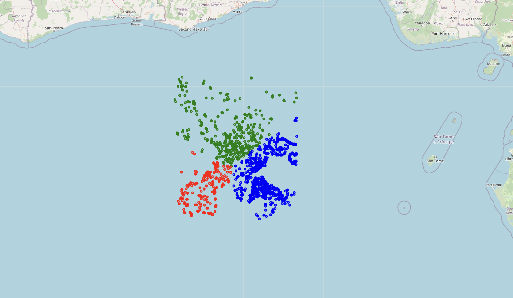

<h2>GeoSpatialClustering</h2>

<h3>Approach</h3>
<ul>
    <li>Loaded the dataset and preprocessed it by removing duplicate values (no missing values were found).</li>
    <li>Extracted latitude and longitude, then normalized them using <code>StandardScaler</code>.</li>
    <li>Removed outliers using the Z-score method, considering data points with Z-score &gt; 3 as outliers because 99.7% of data should ideally fall within 3 standard deviations.</li>
    <li>Used the Elbow Method to determine the optimal number of clusters for K-Means.</li>
    <li>Applied multiple clustering algorithms: K-Means, DBSCAN, Agglomerative Clustering, and Gaussian Mixture Models (GMM).</li>
    <li>Evaluated the clusters using Silhouette Score and Davies-Bouldin Score (results in <code>check.ipynb</code>).</li>
    <li>Visualized the results using scatter plots and folium maps.</li>
</ul>

<h3>Assumptions</h3>
<ul>
    <li>The dataset primarily contains geographical points that can be clustered meaningfully.</li>
    <li>Longitude and latitude features are sufficient for clustering without additional context.</li>
    <li>The optimal number of clusters can be estimated using the Elbow Method.</li>
    <li>DBSCAN parameters (eps and min_samples) were selected based on reasonable defaults.</li>
</ul>

<h3>Hurdles</h3>
<ul>
    <li>Handling duplicate values in the dataset (no missing values were present).</li>
    <li>Finding the right normalization method to improve clustering performance.</li>
    <li>Removing outliers correctly without losing valuable data points.</li>
    <li>Selecting the best number of clusters for K-Means (k=3 vs k=4 decision).</li>
    <li>DBSCAN's sensitivity to parameter selection, which led to poor clustering results in some cases.</li>
    <li>Ensuring the model runs efficiently on an EC2 instance without excessive computation time.</li>
</ul>

<h3>Solution</h3>
<ul>
    <li>Implemented a robust preprocessing pipeline to clean the data efficiently.</li>
    <li>Used feature scaling to improve clustering accuracy.</li>
    <li>Removed outliers using the Z-score method (&gt;3 standard deviations considered outliers).</li>
    <li>Tested multiple clustering methods to compare their performance.</li>
    <li>Automated the process of evaluating clustering performance using metric scores.</li>
</ul>

<h3>Results</h3>
<ul>
    <li>The optimal number of clusters for K-Means was found to be <strong>3</strong> based on the Elbow Method.</li>
    <li>Silhouette Scores showed that K-Means and GMM performed best among the clustering algorithms.</li>
    <li>DBSCAN struggled due to high-density variations in the dataset, requiring careful parameter tuning.</li>
    <li>Visualization plots demonstrated clear separations between clusters in K-Means and Agglomerative Clustering.</li>
    <li>Most of the data points were located in the ocean near Africa, as seen in the visualizations.</li>
</ul>

<h2>Screenshots</h2>

Map before clustering of the Data

Map after clustering using K-Means

Connection of EC2 instance in AWS console

Connection of EC2 instance in VSCode

Before runninng the code on the server

After running the code on the server

<h2>Results</h2>

<h4>Elbow Method</h4>

<h4>Combined graph of various clustering algorithms</h4>

