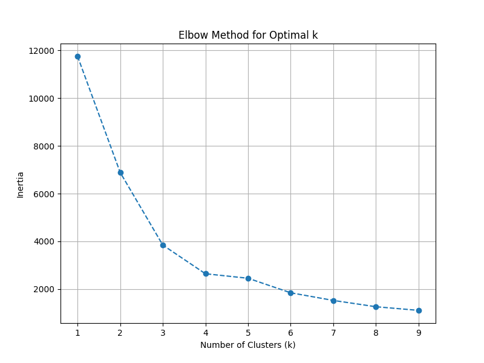
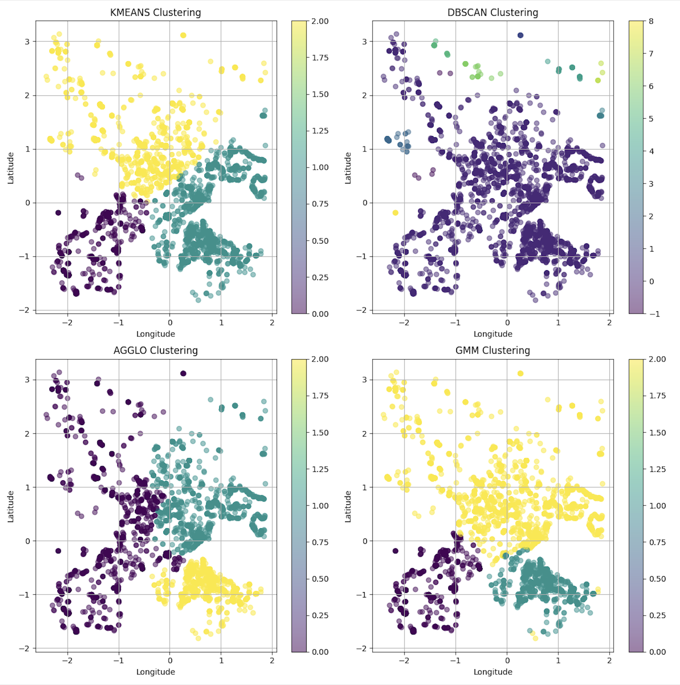

<h2>Geo Spatial Clustering</h2>

<h3>Approach</h3>
<ul>
    <li>Loaded the dataset and preprocessed it by removing duplicate values (no missing values were found).</li>
    <li>Extracted latitude and longitude, then normalized them using <code>StandardScaler</code>.</li>
    <li>Removed outliers using the Z-score method, considering data points with Z-score &gt; 3 as outliers because 99.7% of data should ideally fall within 3 standard deviations.</li>
    <li>Used the Elbow Method to determine the optimal number of clusters for K-Means.</li>
    <li>Applied multiple clustering algorithms: K-Means, DBSCAN, Agglomerative Clustering, and Gaussian Mixture Models (GMM).</li>
    <li>Evaluated the clusters using Silhouette Score and Davies-Bouldin Score (results in <code>check.ipynb</code>).</li>
    <li>Visualized the results using scatter plots and folium maps.</li>
</ul>

<h3>Assumptions</h3>
<ul>
    <li>The dataset primarily contains geographical points that can be clustered meaningfully.</li>
    <li>Longitude and latitude features are sufficient for clustering without additional context.</li>
    <li>The optimal number of clusters can be estimated using the Elbow Method.</li>
    <li>DBSCAN parameters (eps and min_samples) were selected based on reasonable defaults.</li>
</ul>

<h3>Hurdles</h3>
<ul>
    <li>Handling duplicate values in the dataset (no missing values were present).</li>
    <li>Finding the right normalization method to improve clustering performance.</li>
    <li>Removing outliers correctly without losing valuable data points.</li>
    <li>Selecting the best number of clusters for K-Means (k=3 vs k=4 decision).</li>
    <li>DBSCAN's sensitivity to parameter selection, which led to poor clustering results in some cases.</li>
    <li>Ensuring the model runs efficiently on an EC2 instance without excessive computation time.</li>
</ul>

<h3>Solution</h3>
<ul>
    <li>Implemented a robust preprocessing pipeline to clean the data efficiently.</li>
    <li>Used Z-score for outlier removal as it preserves the structure of the dataset while eliminating extreme values.</li>
    <li>Compared multiple clustering methods to find the most effective one.</li>
    <li>Automated the process of evaluating clustering performance using metric scores.</li>
</ul>

<h2>Screenshots</h2>

Map before clustering of the Data

Map after clustering using K-Means

Connection of EC2 instance in AWS console

Connection of EC2 instance in VSCode

Before runninng the code on the server

After running the code on the server

<h2>Results</h2>

<h4>Elbow Method</h4>

<h4>Combined graph of various clustering algorithms</h4>

<h3>Best Model Chosen: K-Means</h3>

After evaluating multiple clustering algorithms—K-Means, DBSCAN, Agglomerative Clustering, and GMM—K-Means was chosen as the best model based on clustering evaluation metrics.

<h4>Why K-Means?</h4>
<ul>
    <li>K-Means produced the highest Silhouette Score (0.527) and the lowest Davies-Bouldin Score (0.701), indicating well-separated and compact clusters.</li>
    <li>DBSCAN struggled due to the high-density variations in the dataset.</li>
    <li>Agglomerative Clustering and GMM had lower Silhouette Scores (0.432 and 0.473, respectively) and higher Davies-Bouldin Scores (0.932 and 0.764), making them less effective.</li>
</ul>

<h4>Why We Used Z-Score for Outlier Removal</h3>
<ul>
    <li>Z-score effectively removes extreme outliers while preserving the core structure of the dataset.</li>
    <li>It is particularly useful for distance-based tasks, making it a natural fit for K-Means, which relies on Euclidean distance.</li>
    <li>Standard deviation alone was not used because it lacks a clear threshold for distinguishing outliers.</li>
</ul>

<h4>Why Not k = 4?</h4>

Although there was a confusion between k=4 and k = 3 earlier, the evaluation metrics showed that k=3 was the optimal choice:

<ul>
    <li>Silhouette Score for k=4: <code>0.526</code> and for k=3: <code>0.527</code>  which is lower for k=4.</li>
    <li>Davies-Bouldin Score for k=4: <code>0.784</code> and for k=3: <code>0.701</code>  which a higher score for k=4 (indicating poorer separation).</li>
</ul>

Since Davies-Bouldin Score should be as low as possible, and k = 3 had the best trade-off, it was selected.

<h3>Results</h3>
<ul>
    <li>The optimal number of clusters was found to be <strong>3</strong> based on metric scores.</li>
    <li>K-Means outperformed other clustering methods in terms of cluster cohesion and separation.</li>
    <li>Visualization confirmed that K-Means provided the most distinct and interpretable clusters.</li>
</ul>
